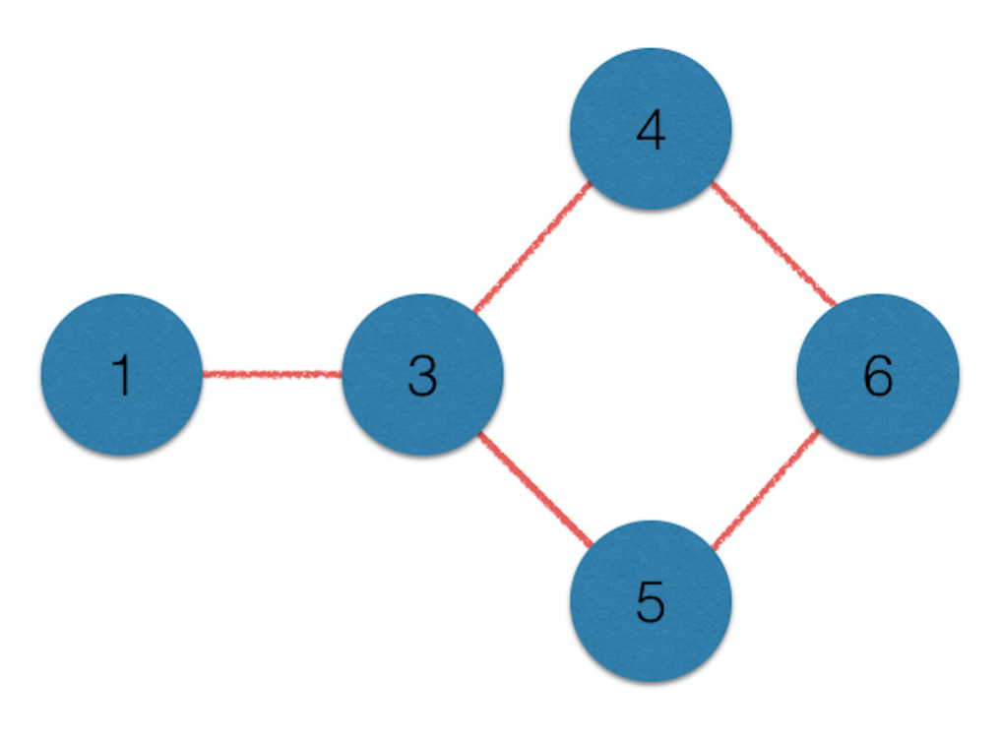
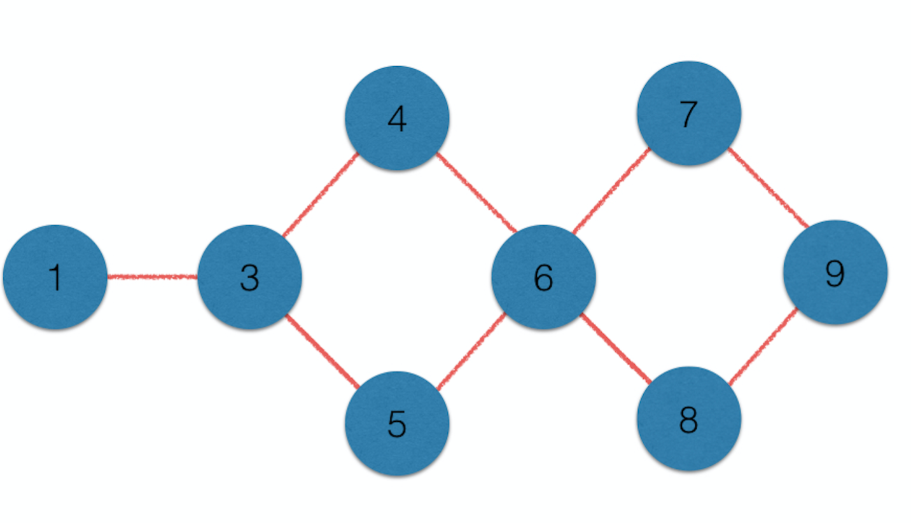
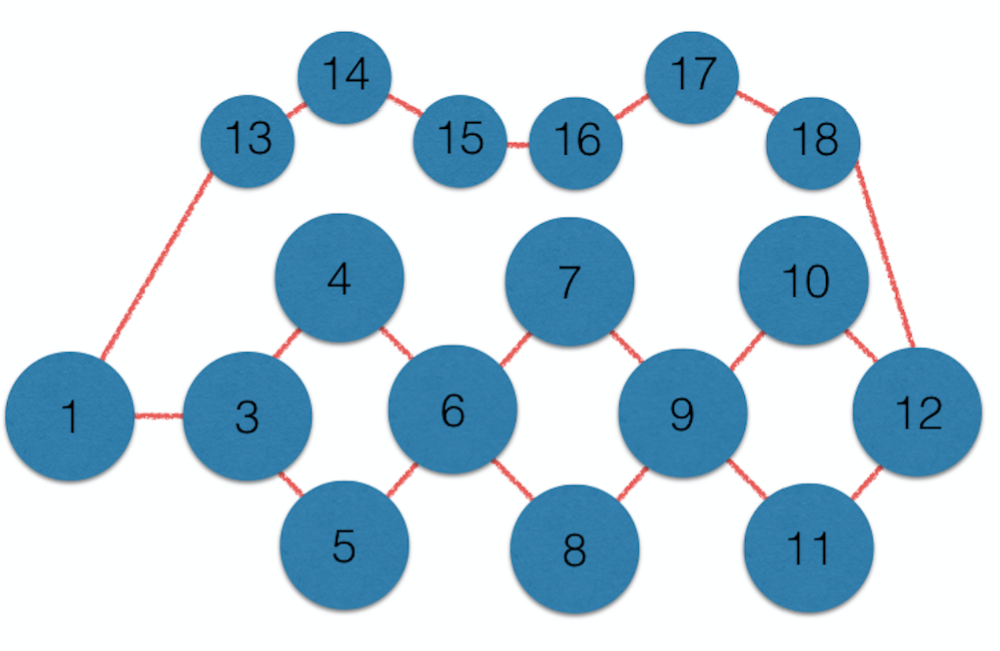
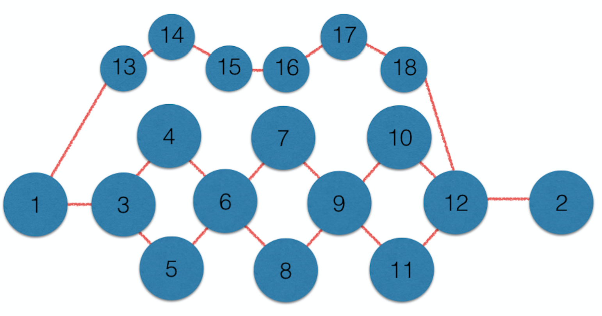

# 神奇的最短路徑變形

## 前言

感謝謝旻錚老師今天在寒訓第一天給的大力協助，故撰寫出此篇文章，以示感謝。（新手上路，請多多包涵！）

## [Round 228 Division 2 問題Ｄ](http://codeforces.com/contest/389/problem/D)

有一種題目，是給一張無相圖和起點與終點，並要我們求出從起點到終點有幾條最短路徑。

而這個問題剛好相反，是給出一個正整數 K，要我們建出一張從起點到終點**剛好**有 K 條最短路徑的圖(指定起點為1，終點為2)。

這題有很多種可能的答案，只要輸出一個符合題目條件的即可。

## 題解

我們可以對題目要求的最短路徑總數 K 進行二進位表示法的分析，再利用乘法原理配合加法原理即可得到答案，即從左而右去造出一張無相圖，來滿足題目的最短路徑總數。

舉例來說，如果我們要造出一張有 9 條最短路徑的圖，我們可以先求出 9 的二進位表示法(9 = 8 + 1 => 1001)，然後依序造出

1. 包含 1 條最短路徑的圖（就是直接造出一條兩點的連線即可。）

2. 包含 2 條最短路徑的圖 (二進位表示法中的 10 為 2)。因為最後一位是0，所以從乘法原理我們可以發現，造出一個菱形，即可讓路徑總數變成 `1 * 2 = 2`。

3. 包含 4 條最短路徑的圖 (二進位表示法中的 100 為 4) 。因為最後一位是0，所以從乘法原理我們可以發現，造出一個菱形，即可讓路徑總數變成 `1 * 2 * 2 = 4`。

4. 包含 9 條最短路徑的圖 (二進位表示法中的 1001 為 9)。因為最後一位是1，所以從乘法原理我們可以發現，造出一個菱形，即可讓路徑總數變成 `1 * 2 * 2 * 2 = 8`。然後我們再利用加法原理，補上一條從起點 1 到目前最遠端點的等長路徑，即可讓路徑總數變成 `1 * 2 * 2 * 2 + 1 = 9`。

5. 最後記得補上連接到 2 的邊，以符合題目的要求。


### 其他測資的示意圖

#### 4


input
```
4
```

output
```
9
NNYNNNNNN
NNNNNNNNY
YNNYYNNNN
NNYNNYNNN
NNYNNYNNN
NNNYYNYYN
NNNNNYNNY
NNNNNYNNY
NYNNNNYYN
```

#### 7

input
```
7
```

output
```
15
NNYNNNYNNNNYNNN
NNNNNNNNNNYNNNN
YNNYYNNNNNNNNNN
NNYNNYNNNNNNNNN
NNYNNYNNNNNNNNN
NNNYYNNYYYNNNNN
YNNNNNNYNNNNNNN
NNNNNYYNNNNNNNN
NNNNNYNNNNYNNNN
NNNNNYNNNNYNNNN
NYNNNNNNYYNNNNY
YNNNNNNNNNNNYNN
NNNNNNNNNNNYNYN
NNNNNNNNNNNNYNY
NNNNNNNNNNYNNYN
```


